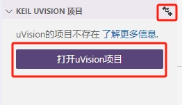
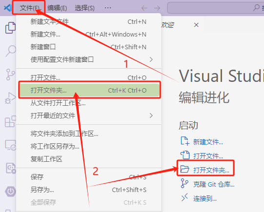
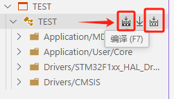
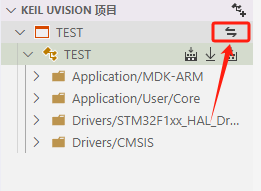

# Keil Assistant

***
## [中文📄](./README.md)
***

## Summary 📑

Keil assistive tool on VScode, used with C/C++ plug-in.

It provides syntax highlighting, code snippets for Keil projects, and supports compiling and downloading Keil projects.

**Keil uVison 5 and above is supported only**  

**Windows platform only**


***

## Features 🎉

- Load the Keil C51/ARM project and display the project view as the Keil project style
- Automatically monitor keil project files for changes and keep project views up to date
- Compile, recompile, and burn Keil projects by calling the Keil command-line interface
- Automatically generate c_cpp_property.json for C/C++ plug-in
- Supports generating compile_commands.json via command (shortcut key: ctrl+shift+p, search for Generate compile_commands.json(MDK only)).

***

***
## Download📌
 [ Visual Studio Marketplace](https://marketplace.visualstudio.com/items?itemName=jacksonjim.keil-vscode-assistant)
***

## Usage 📖

### Preparatory work

1. Install the C/C++ plug-in
>
2. Go to the Keil-Assistant plug-in Settings and set the absolute path of the Keil executable uv4.exe
 
 

- From v1.7.3+ version, you only need to configure the Keil installation directory, simplifying the relevant configuration items (the default directory is: C:Keil_v5)

- v1.8.0+ version is convenient for some users to set the C51 or C251 installation directory separately to add an optional setting, by default only need to set the MDK installation directory, only support: MDK, C51, C251; For details, refer to the example in Settings

 

- V1.9.3+ version ⚠️ adjustment: VsCode supports the minimum version of vscode engines V1.73.0+, please update to V1.73.0 or later, this adjustment is because the minimum supported version of the multi-language version is 1.73.0; [**l10n** This API, introduced in VS Code 1.73](https://github.com/microsoft/vscode-l10n/blob/main/README.md)

***

### Start 🏃‍♀️

1. Create a project on Keil, add files, header path, etc
> 
2. Click **Open the Project** icon or **Use Vscode to directly open the directory where keil project file (.uvproj) is located**, and the keil project will be automatically loaded by the plug-in;
 
  - Open *.uvproj project file
  
    

  - Quickly open a project 1  **Right click on the project root folder --> open through vscode**
    
    
  
  - Quickly open a project 2  **In vscode-->File--Open the folder (shortcut key: Ctrl+k Ctrl+O), select the directory where the project is located**
    
    

### Common operations

- **Compile(F7) and burn(F8)**：Three buttons are provided, one for compile, one for download, and one for recompile
 
 

>

- **Save and refresh**：Add/delete the source file, change and configure the project on Keil. Click **Save all** when the change is finished. The plug-in will automatically refresh the project when it detects the change of the Keil project
 
 

>

- **Open source file**：Clicking the source file will open it in preview mode, and double-clicking the source file will switch it to non-preview mode
 
 

>

- **Toggle the C/C++ plug-in configuration**：Click the target name to toggle between multiple C/C++ configurations
 
 

>

- **Switch keil Target(CTRL+T)**：Click the project toggle button to toggle between multiple Keil targets
 
 

>

- **Show reference**：After compilation is complete, you can expand the reference by clicking on the arrow icon for the source item (ARM project only)
 
 

***

### Other settings

- Workspace Settings: Project exclusion list(`KeilAssistant.Project.ExcludeList`)
 When there are multiple Keil projects in a directory, open it with the plug-in, and the plug-in loads all keil projects. This option allows you to specify which Keil projects you want to exclude, preventing the project from being automatically loaded when the workspace is opened
 **The default exclusion list**：
  ```json
  [
      "template.uvproj",
      "template.uvprojx"
  ]
  ```


### Interrupt prompt questions about C51/C251

- Add the following code substitution to the code header file
- C51 Code section

```c
#ifndef __VSCODE_C51__
#define INTERRUPT(x) interrupt x
#else
#define INTERRUPT(x)
#endif
```

- C251 Code section

```c
#ifndef __VSCODE_C251__
#define INTERRUPT(x) interrupt x
#else
#define INTERRUPT(x)
#endif

```

- Example Code

```c
void UART1_int(void) INTERRUPT(UART1_VECTOR)
{
    if (RI)
    {
      RI = 0;
    }

    if (TI)
    {
      TI = 0;
    }
}
```

### Any other questions ?

You can go to the following places to communicate

- [Discussion: https://discuss.em-ide.com/t/keil-assistant](https://discuss.em-ide.com/t/keil-assistant)

- [Github Issue: https://github.com/jacksonjim/keil-assistant/issues](https://github.com/jacksonjim/keil-assistant/issues)